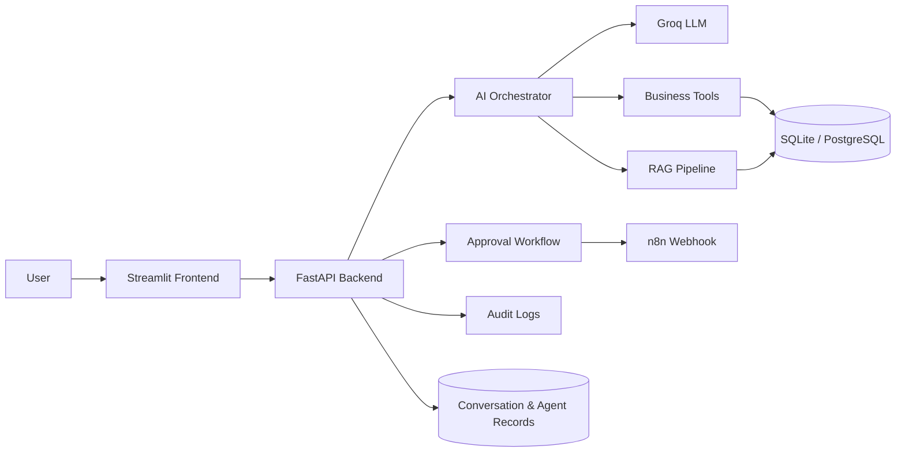

# AI Business Operations Copilot

**Ops Copilot** is an AI-powered business operations platform that brings together **Agentic AI, RAG, Business Intelligence, workflow automation, and human approval workflows** into one application.

Instead of functioning as a simple chatbot, Ops Copilot can understand business questions, retrieve information from company documents, analyze operational data, identify business insights, and prepare approval-gated business actions.

Built with **Python, FastAPI, Streamlit, SQLAlchemy, LangGraph, Groq, RAG, JWT/RBAC, Plotly, PostgreSQL/SQLite, Docker, and n8n-ready automation**.

## Project Status

🚧 **Work in Progress / Portfolio Demo**

Ops Copilot is currently under active development. The current version is a functional portfolio demo showcasing the core architecture, Agentic AI, RAG, business intelligence, approval workflows, and automation-ready capabilities.

A professional demo video is provided separately to demonstrate the current application experience and key features.

Additional integrations, UI improvements, testing, and production-level enhancements are still in progress. External services such as Groq, PostgreSQL, and n8n can be connected through environment-based configuration when required.

## Why Ops Copilot?

Many business systems separate analytics, documents, customer information, inventory, and automation into different tools.

Ops Copilot brings these capabilities together through an AI-powered operations layer.

A user can ask questions such as:

* Which products are below their reorder threshold?
* Why did revenue change this month?
* What does our return policy say?
* Who are our top customers?
* Prepare a reorder request for critical inventory.
* Generate this week's business report.

The AI can route requests to the appropriate business tools, retrieve supporting documents, analyze structured data, and provide grounded responses.

Sensitive actions remain **approval-gated** before execution.

## Core Features

### 🤖 AI Copilot

* AI-powered business operations assistant
* Agent-style tool routing
* Specialized business tools for different operations
* Conversation history
* Tool execution tracking
* Agent run and tool-call records
* Configurable Groq LLM integration
* Local fallback behavior when external AI credentials are unavailable

### 📚 RAG Document Intelligence

* Upload PDF, TXT, Markdown, and DOCX documents
* Automatic text extraction
* Document chunking
* Semantic embeddings when available
* Local lexical retrieval fallback
* Document and page-level citations
* Evidence-grounded responses
* Protection against unsupported claims
* Documents treated as untrusted evidence

### 📊 Business Intelligence

* Revenue analysis
* Transaction trends
* Sales summaries
* Top products
* Customer activity
* Inventory monitoring
* Low-stock detection
* Business performance insights
* AI-generated business reports
* Interactive Plotly visualizations

### 📦 Business Operations

* Product management
* Inventory monitoring
* Sales analysis
* Customer management
* Order information
* Business policy retrieval
* Controlled business-data tools

### ✅ Human-in-the-Loop Approvals

Sensitive actions do not execute immediately.

The platform supports:

* Reorder proposals
* Pending approvals
* Manager/admin approval
* Approved actions
* Rejected actions
* Approval history
* Auditability

### ⚡ Automation

n8n-ready workflow integration for:

* Low-stock alerts
* Weekly business reports
* Approved reorder workflows
* Customer follow-ups
* Other business automation workflows

In demo mode, automation actions are simulated locally and are **not sent to external services**.

### 🔐 Security

* JWT authentication
* bcrypt password hashing
* Role-based access control
* Admin, Manager, and Employee roles
* Protected API routes
* Controlled database queries
* No unrestricted model-generated SQL
* Approval gates for sensitive operations
* Audit logs
* Restricted document uploads
* Environment-based secrets

## Architecture



## Technology Stack

| Area                | Technology                               |
| ------------------- | ---------------------------------------- |
| Language            | Python 3.11+                             |
| Frontend            | Streamlit                                |
| Backend             | FastAPI                                  |
| ORM                 | SQLAlchemy                               |
| Database            | SQLite / PostgreSQL                      |
| Agent Orchestration | LangGraph                                |
| LLM                 | Groq-compatible API                      |
| RAG                 | Sentence Transformers + lexical fallback |
| Embeddings          | `all-MiniLM-L6-v2`                       |
| Authentication      | JWT                                      |
| Password Security   | bcrypt                                   |
| Visualization       | Plotly                                   |
| PDF Processing      | PyMuPDF                                  |
| Document Processing | python-docx                              |
| Automation          | n8n Webhooks                             |
| Containerization    | Docker / Docker Compose                  |
| API                 | REST / FastAPI                           |

## Agentic AI

Ops Copilot uses an allowlisted tool-routing architecture rather than allowing the LLM to directly access the database.

Example tools include:

```text
search_documents
retrieve_knowledge
get_inventory
get_low_stock_products
get_sales
get_sales_summary
get_top_products
get_customer
search_customers
get_orders
analyze_sales
generate_business_report
get_business_policy
create_action_request
trigger_automation
```

The model can determine which approved tool is relevant to a request, while the backend remains responsible for validation and execution.

### Example

```text
User
  ↓
AI Copilot
  ↓
Intent / Tool Routing
  ↓
Business Tool
  ↓
Validated Backend Query
  ↓
Business Data
  ↓
AI Response
```

The application does **not** allow unrestricted model-generated SQL.

## RAG Pipeline

The document intelligence pipeline follows:

```text
Document Upload
      ↓
Text Extraction
      ↓
Text Chunking
      ↓
Embeddings
      ↓
Vector / Local Retrieval
      ↓
Relevant Chunks
      ↓
AI Copilot
      ↓
Grounded Response + Citation
```

Supported document types:

* PDF
* TXT
* Markdown
* DOCX

When semantic embeddings are unavailable, the application can use local lexical retrieval so the core demo remains functional without an external vector database.

## Business Data

The local demo contains interconnected business data including:

* Products
* Inventory
* Customers
* Sales
* Orders
* Business policies
* Approval records
* Automation logs
* Audit activity
* Conversations
* Agent runs
* Tool calls

The seed data is designed to produce realistic relationships between modules and meaningful dashboard metrics.

## Authentication & Roles

Ops Copilot supports role-based access:

### Admin

Full system access including administration and approval capabilities.

### Manager

Business operations, analytics, approvals, and operational workflows.

### Employee

Restricted access to permitted business operations.

Passwords are securely hashed and are never stored as plaintext.

## Run Locally

### 1. Create virtual environment

```powershell
python -m venv .venv
```

### 2. Install dependencies

```powershell
.venv\Scripts\python.exe -m pip install -r requirements.txt
```

### 3. Create environment file

```powershell
Copy-Item .env.example .env
```

Configure the required values in `.env`.

### 4. Seed demo data

```powershell
.venv\Scripts\python.exe -m app.backend.seed
```

The seed command is idempotent and restores the Northstar Outfitters demo workspace with interconnected products, customers, transactions, policies, approvals, and example activity.

### 5. Start FastAPI

```powershell
.venv\Scripts\python.exe -m uvicorn app.backend.main:app --reload
```

### 6. Start Streamlit

Open a second terminal:

```powershell
.venv\Scripts\python.exe -m streamlit run app/frontend/streamlit_app.py
```

Open:

```text
http://localhost:8501
```

## Demo Credentials

These accounts are provided **for local portfolio/demo exploration only**.

| Role     | Email                 | Password           |
| -------- | --------------------- | ------------------ |
| Admin    | `admin@demo.local`    | `DemoAdmin123!`    |
| Manager  | `manager@demo.local`  | `DemoManager123!`  |
| Employee | `employee@demo.local` | `DemoEmployee123!` |

These are seeded demo credentials and are **not API keys or provider credentials**.

Change or disable demo accounts before any production deployment.

## Configuration

Configuration is managed through `.env`.

See:

```text
.env.example
```

Important variables include:

```text
DATABASE_URL
JWT_SECRET
GROQ_API_KEY
GROQ_MODEL
N8N_WEBHOOK_URL
N8N_API_KEY
API_BASE_URL
DEMO_MODE
```

### Local Development

SQLite can be used for zero-setup development:

```text
DATABASE_URL=sqlite:///./ops_copilot.db
```

### PostgreSQL

For deployment, configure a PostgreSQL-compatible connection such as a Supabase PostgreSQL database.

### Groq

Groq credentials are optional for the local demo.

Without Groq credentials, deterministic business-tool routing and retrieval remain available, while open-ended AI synthesis falls back to a clearly marked local response.

### n8n

n8n integration is optional.

Configure:

```text
N8N_WEBHOOK_URL
```

when connecting the application to a real n8n workflow.

An API key is only required if the selected n8n integration uses authenticated API access.

## Demo Mode

`DEMO_MODE=true` is the default.

In demo mode:

* The seeded business workspace is available locally.
* Groq is optional.
* n8n is optional.
* Approval actions are recorded and simulated.
* External automation requests are disabled.
* No external workflow is triggered.

This allows the complete application concept to be demonstrated without requiring paid infrastructure or external service credentials.

## Automation Workflow

The application is designed to connect approved actions to n8n workflows.

Example:

```text
Low Inventory Detected
        ↓
AI Creates Reorder Proposal
        ↓
Manager Reviews Request
        ↓
Approval
        ↓
n8n Webhook
        ↓
External Workflow
        ↓
Notification / Report / Business Action
        ↓
Audit Log
```

Example workflow definitions are available under:

```text
n8n/workflows/
```

## API

FastAPI provides an interactive API reference at:

```text
/docs
```

Important routes include:

```text
/auth/login
/auth/me

/dashboard/summary

/inventory
/sales/summary
/customers
/documents
/rag/query

/copilot/chat
/approvals
/audit-logs
```

Protected endpoints use:

```text
Authorization: Bearer <token>
```

## Docker

Docker Compose can start the application services:

```powershell
docker compose up --build
```

Seed the database:

```powershell
docker compose exec api python -m app.backend.seed
```

The Docker setup is intended for local development and testing.

## Testing

Run the test suite with:

```powershell
.venv\Scripts\python.exe -m pytest
```

The current project includes automated tests covering core backend functionality, authentication, business operations, RAG behavior, approvals, and related application flows.

## Security Notes

Before production deployment:

* Replace the demo `JWT_SECRET`
* Remove or disable demo accounts
* Configure HTTPS
* Use a managed PostgreSQL database
* Store secrets through environment variables or platform secret management
* Configure backups
* Configure provider-side rate limits
* Review authentication and authorization policies
* Enable production logging and monitoring
* Configure secure n8n authentication where required

Never commit:

```text
.env
API keys
database credentials
JWT secrets
private keys
Streamlit secrets
virtual environments
local databases
```

## Example Business Prompts

Try asking the AI Copilot:

```text
Which products are below their reorder threshold?

Compare this month's revenue with last month.

Who are our top customers?

What does the return policy say?

Prepare a reorder request for critical inventory.

Generate this week's business report.

Analyze our recent sales performance.

Which products should we prioritize for restocking?
```

## Project Structure

```text
ops-copilot/
│
├── app/
│   ├── backend/
│   ├── frontend/
│   ├── agents/
│   ├── rag/
│   ├── tools/
│   ├── auth/
│   └── database/
│
├── data/
├── docs/
├── n8n/
│   └── workflows/
│
├── scripts/
├── tests/
│
├── .env.example
├── .gitignore
├── Dockerfile
├── docker-compose.yml
├── requirements.txt
└── README.md
```

## Portfolio Highlights

This project demonstrates practical implementation of:

* **Agentic AI**
* **RAG**
* **LLM tool use**
* **Business intelligence**
* **AI-powered analytics**
* **Human-in-the-loop workflows**
* **Workflow automation**
* **REST API development**
* **FastAPI**
* **Streamlit**
* **PostgreSQL**
* **JWT/RBAC**
* **Vector/semantic retrieval**
* **Document intelligence**
* **Docker**
* **n8n integration**
* **Auditability and secure business actions**

## Screenshots & Demo

The current repository does not include screenshot or video assets.

A professional demo video is provided separately to showcase the current application experience and development progress.

## Future Improvements

Planned improvements include:

* Production deployment
* Live n8n workflow execution
* More advanced agent orchestration
* Improved semantic retrieval
* Persistent vector database integration
* Advanced business forecasting
* More granular permissions
* Additional automation workflows
* Expanded monitoring and observability
* Production-grade testing and performance optimization

## License

This project is currently intended as a **portfolio and demonstration project**.

---

**Built with Python, FastAPI, Streamlit, Agentic AI, RAG, and workflow automation.**
