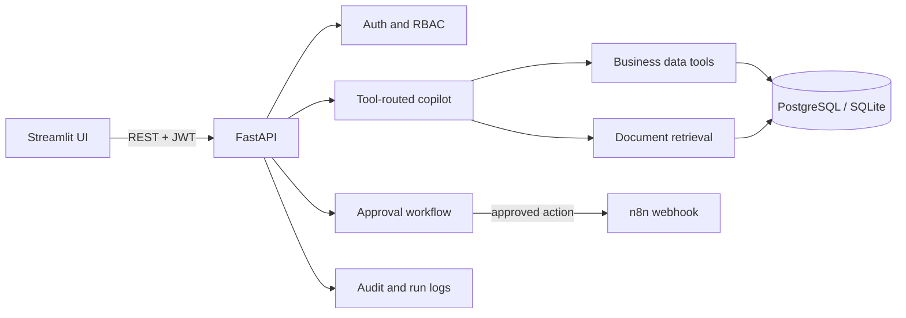

# AI Business Operations Copilot

A small-business operations workspace that combines a FastAPI service, a Streamlit SaaS-style interface, a tool-routed copilot, document retrieval with citations, business analytics, approval-gated actions, and auditable automation. The backend owns business logic and uses parameterized SQL only. SQLite is the zero-setup local adapter; set `DATABASE_URL` to a PostgreSQL/Supabase URL for deployment.

## Features

- AI Copilot uses an agent-style, allowlisted tool router for inventory, sales, customer, reporting, and policy questions. Groq function selection is optional.
- RAG for PDF, TXT, Markdown, and DOCX documents, with chunk retrieval and document/page citations. Semantic embeddings are optional; local lexical retrieval remains available.
- Business data tools use controlled queries rather than model-generated SQL. Results power the dashboard, sales and inventory analysis, customer views, and reports.
- Analytics dashboard with revenue and transaction trends, product performance, customer segments, and seeded business signals.
- Human-in-the-loop reorder approvals with pending, approved, and rejected history.
- n8n webhook integration for approved actions. External delivery only occurs when demo mode is disabled and a webhook is configured.
- JWT authentication, password hashing, server-side role-based access (`admin`, `manager`, `employee`), and audit logs for operational activity.
- Conversation, agent-run, and tool-call records; downloadable Markdown business reports.

## Tech Stack

Python 3.11, FastAPI, Streamlit, SQLAlchemy, SQLite for local development, PostgreSQL-compatible configuration, Pydantic Settings, JWT, bcrypt, Plotly, PyMuPDF, optional sentence-transformers, and optional Groq/n8n integrations. Docker Compose is provided for local services.

## Architecture



## Run locally

```powershell
python -m venv .venv
.venv\Scripts\python.exe -m pip install -r requirements.txt
Copy-Item .env.example .env
.venv\Scripts\python.exe -m app.backend.seed
.venv\Scripts\python.exe -m uvicorn app.backend.main:app --reload
```

In a second terminal:

```powershell
.venv\Scripts\python.exe -m streamlit run app/frontend/streamlit_app.py
```

The API creates database tables during startup. Run the seed command once before logging in. It is idempotent and rebuilds the Northstar Outfitters demo catalog, customers, transactions, policy fixtures, approvals, and example activity so their relationships and metrics remain consistent. Demo accounts are repaired if needed; documents uploaded under other filenames and non-demo user accounts are preserved. Reseeding replaces workspace sales/orders and clears approval, conversation, agent-run, automation, and audit history before restoring the examples. The legacy `.venv\Scripts\python.exe scripts/seed_database.py` command remains supported. Run checks with `.venv\Scripts\python.exe -m pytest`.

Open `http://localhost:8501`. **DEMO credentials for local exploration only** (these are seeded demo accounts, not provider/API credentials; change or disable them outside a local demo): `admin@demo.local` / `DemoAdmin123!`, `manager@demo.local` / `DemoManager123!`, `employee@demo.local` / `DemoEmployee123!`.

## Configuration

See `.env.example`. The frontend reads `API_BASE_URL` (with `API_URL` retained as a compatibility fallback). Without Groq credentials, deterministic business tool routing and retrieval remain usable; open-ended narrative synthesis falls back to a clearly marked local response. Sentence-transformers is optional because its model download can be large; lexical retrieval works without it. PostgreSQL requires a psycopg driver and `DATABASE_URL`. For local quick start use SQLite.

## Docker

`docker compose up --build` starts API, Streamlit, and PostgreSQL. Seed the database inside the API container with `docker compose exec api python -m app.backend.seed`.

## Agent and RAG

Requests are mapped to allowlisted typed tools (inventory, sales, customers, policy documents, report, and reorder proposal). No model-generated SQL is run. Tool summaries, results metadata, status and final answer are saved per agent run. The RAG pipeline extracts text, creates bounded chunks and stores metadata; embeddings use `all-MiniLM-L6-v2` when available, otherwise token overlap ranks chunks. Retrieved text is treated as untrusted evidence and the response states when evidence is insufficient.

## API

FastAPI's interactive API reference is available at `/docs`. Key routes include `/auth/login`, `/auth/me`, `/dashboard/summary`, `/inventory`, `/sales/summary`, `/customers`, `/documents`, `/rag/query`, `/copilot/chat`, `/approvals`, and `/audit-logs`. Protected routes require `Authorization: Bearer <token>`.

## Automation and deployment

Set `N8N_WEBHOOK_URL` (and optionally `N8N_API_KEY`) to call a workflow after approval. Without a URL, the approval is still recorded and simulated. Example payload workflows are under `n8n/workflows/`. The API is a standard ASGI service suitable for Render-like hosts; Streamlit can be deployed separately on Streamlit Community Cloud. Configure the frontend's `API_BASE_URL` to the deployed backend (`API_URL` remains a supported alias). Free-tier limits and availability vary by provider; no paid provider is required by the code.

## Demo Mode

`DEMO_MODE=true` is the default. The seeded Northstar Outfitters workspace is usable without Groq or n8n credentials. Approval-gated actions are recorded and simulated locally; demo mode does not send external automation requests. Groq, n8n, PostgreSQL, and hosting are configuration options, not pre-connected services.

## Screenshots and Walkthrough

No screenshot or video assets are currently included in this repository.

## Security notes

Passwords use bcrypt; JWT secret must be replaced for deployments. Upload size and extensions are restricted. Business tools use controlled queries. Sensitive actions require manager/admin approval. Configure HTTPS, strong secrets, managed backups, and provider-side rate limits before production use. Demo mode disables outbound automation.

## Example prompts

- Which products are below their reorder threshold?
- Compare this month's revenue with last month.
- Who are our top customers?
- What does the return policy say?
- Prepare a reorder request for critical items.
- Generate this week's business report.

## Portfolio summary

Python, FastAPI, Streamlit, SQL, PostgreSQL compatibility, JWT/RBAC, agentic tool use, RAG, embeddings, Plotly, approval workflows, webhooks, Docker and REST API design.
